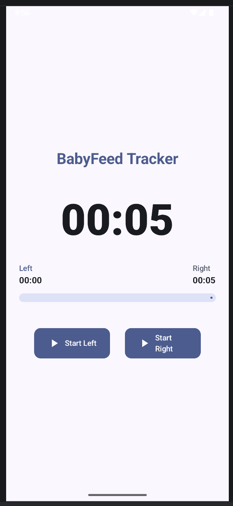
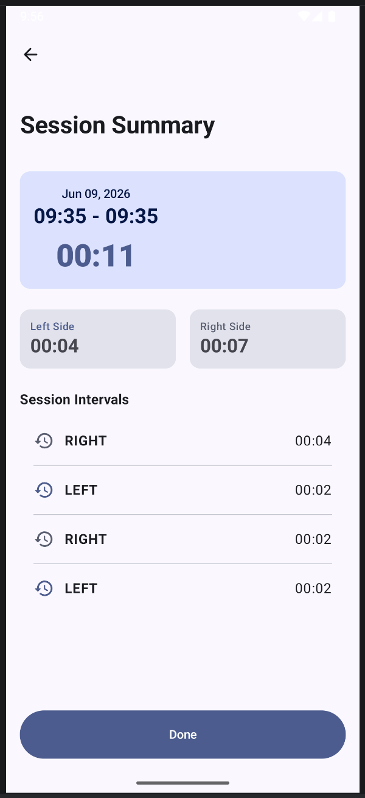
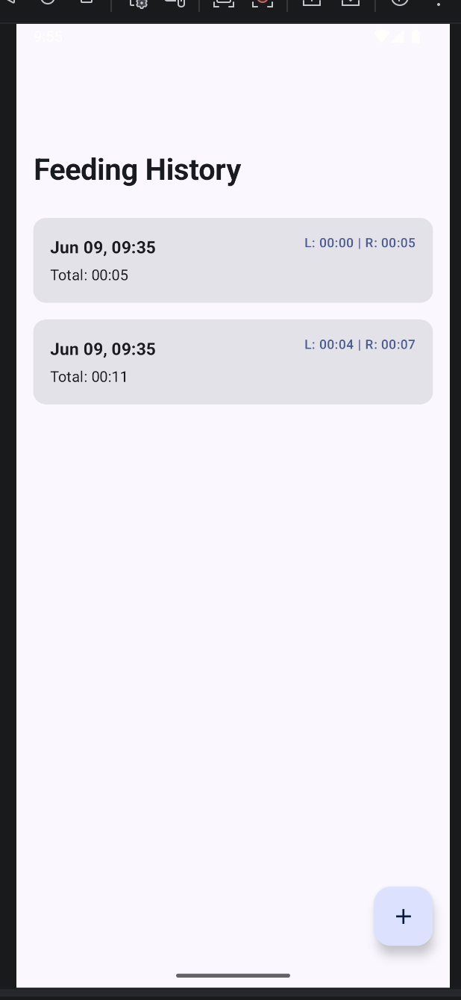
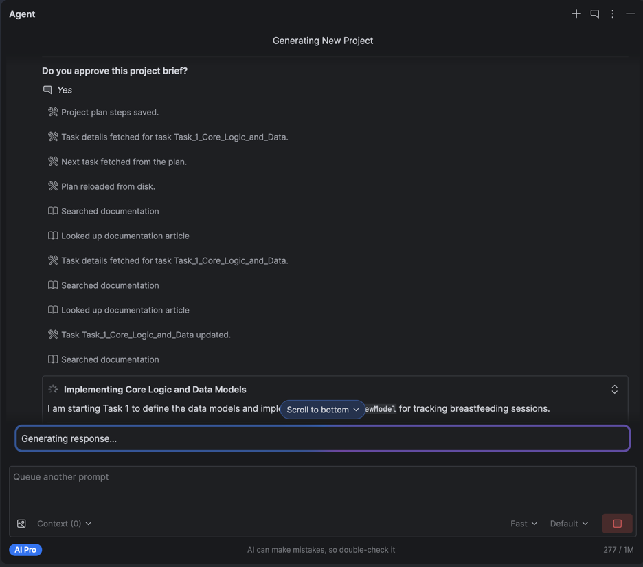
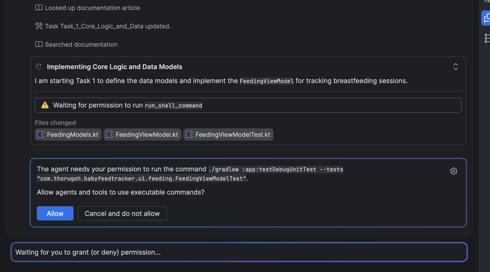

# BabyFeed Tracker

A proof of concept Android app built entirely by **Gemini in Android Studio** (AI Pro), with zero manual coding. The goal was to evaluate Gemini's agentic capabilities end-to-end: from project brief to a working app.

## Prompt used

> Create an app to track a baby's breastfeeding sessions. Core Tracking Logic:
>
> Record the exact start and end time for each overall feeding session.
>
> Track which side (Left or Right) is being used.
>
> Allow side-switching within a single continuous session (e.g., starting on the Right for 5 minutes, then switching to the Left for 12 minutes).
>
> Calculate and display the exact duration spent on each side per session.

## What was built

A breastfeeding session tracker with the following planned features:

- Active session timer (start/stop with timestamps)
- Real-time side switching (Left/Right) with per-side duration tracking
- Live session dashboard with elapsed time breakdown
- Post-session summary screen

The agent planned the work in four tasks, executed them sequentially over ~55 minutes, and left Task 4 (refinement and final verification) unfinished.

## Gemini in Android Studio — Evaluation

### Strengths

**Documentation access**: Gemini actively searched and looked up documentation during implementation (visible in the screenshots). It correctly referenced Jetpack Compose, Navigation 3, Material 3, and Kotlin Coroutines APIs rather than hallucinating outdated patterns.

**Project architecture**: The generated code follows MVVM properly — `FeedingViewModel`, data models, and UI are cleanly separated into dedicated packages. It also wrote unit tests (`FeedingViewModelTest`) without being asked, and asked for shell permission to run them via Gradle. Best practices were applied without prompting.

**Agentic workflow**: The agent broke the work into structured tasks with acceptance criteria, tracked status, and executed them in order. The screenshots show it consulting docs, running tests, and managing its own plan file — a reasonably autonomous loop.

### Weaknesses

**Unfinished features**: Task 4 was left `IN_PROGRESS`. The vibrant Material 3 theme, Edge-to-Edge display, and adaptive layouts were planned but not delivered. The agent stopped before completing its own plan.

**Broken features**: The features that were delivered do not work correctly. Core flows like the session timer and side-switching behave unexpectedly — the app does not function as described in the plan.

**Lack of creativity / poor UI**: The interface is generic and bland. Despite the plan calling for a "vibrant and energetic aesthetic" with Material Design 3, the result is a bare-bones layout with no visual polish. Gemini can follow a spec but does not bring any design judgment of its own.

## App Screenshots

| Tracker (main screen) | Session Summary | Feeding History |
|---|---|---|
|  |  |  |

The main screen shows the timer and Left/Right buttons but has no active session state — tapping either button does not lock in a side or start tracking correctly. The session summary screen shows the per-side breakdown and intervals but displays the same timestamp for start and end (09:35 - 09:35). The feeding history screen lists past sessions but was not part of the original plan, and data shown is inconsistent with what was entered.

## Agent Screenshots

| Agent planning & doc lookup | Permission prompt for running tests |
|---|---|
|  |  |

## Verdict

Gemini in Android Studio is a capable scaffold generator for well-defined Android projects. It is strong on structure, conventions, and API awareness. It falls short on delivery completeness, UI quality, and functional correctness — not yet reliable enough to ship features without human review and intervention.
